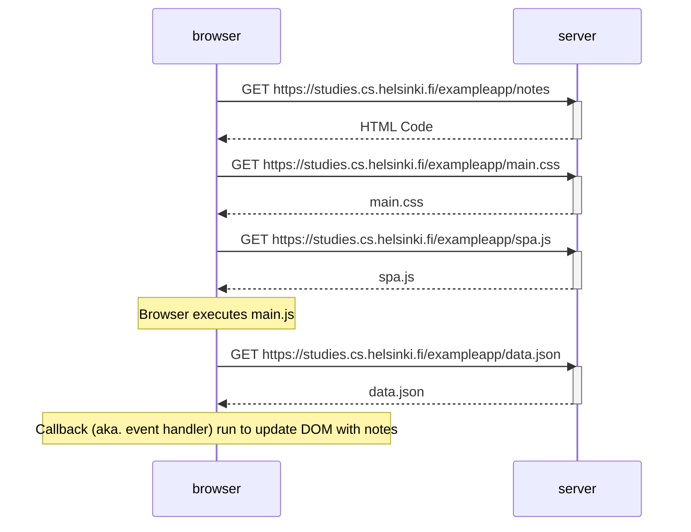

```mermaid
sequenceDiagram
    participant browser
    participant server

    browser->>server: GET https://studies.cs.helsinki.fi/exampleapp/notes
    activate server
    server-->>browser: HTML Code
    deactivate server

    browser->>server: GET https://studies.cs.helsinki.fi/exampleapp/main.css
    activate server
    server-->>browser: main.css
    deactivate server

    browser->>server: GET https://studies.cs.helsinki.fi/exampleapp/spa.js
    activate server
    server-->>browser: spa.js
    deactivate server

    Note over browser: Browser executes main.js

    browser->>server: GET https://studies.cs.helsinki.fi/exampleapp/data.json
    activate server 
    server-->>browser: data.json
    deactivate server

    Note over browser: Callback (aka. event handler) run to update DOM with notes
```